In this tutorial, we are going to build a simple machine learning model as a flask app and deploy to Kubernetes and consume it as an API.

We are going to begin with creating the cluster first because provisioning it will take up to 20 min.

* Log into your IBM Cloud account
* Create a new cluster from the Catalog

* Create resource --> Kubernetes service

* Give it a name and select the 'Free cluster' plan then click 'Create'


# Creating the model
As this is more towards templating a simple flask inference engine on Kubernetes we are going to keep the model real simple

We will be building a simple [iris classification](https://archive.ics.uci.edu/ml/datasets/iris) model using a [jupyter notebook](https://jupyter.org/install)

```
git clone https://github.com/krishnac7/COSmodelDeploy.git
cd COSmodelDeploy-master
jupyter notebook Model_training.ipynb
```
the below cell creates the required model

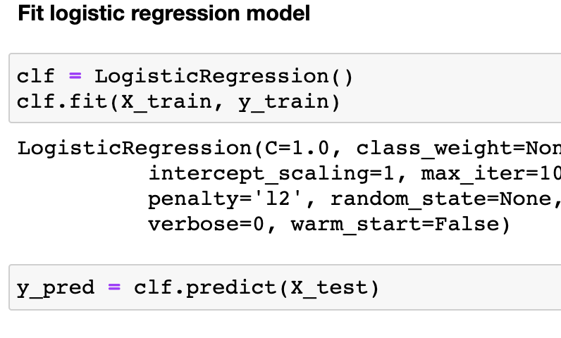

and then we save the model as a pickle file to import later into our inference app

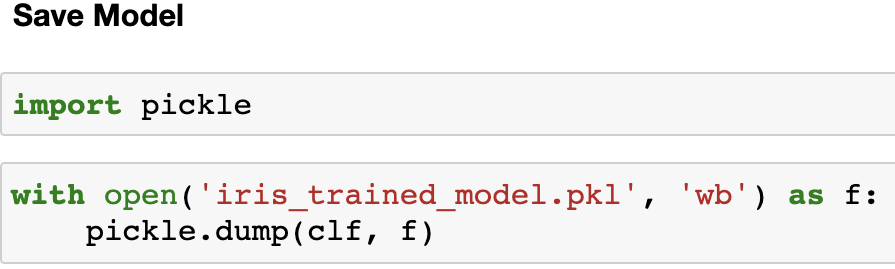


while we are on the topic, here is a good read on [object serialization](https://stackoverflow.com/questions/447898/what-is-object-serialization) and the security [issues that come with pickle](https://www.smartfile.com/blog/python-pickle-security-problems-and-solutions/)

Now we see a new pickle file in the /models folder

# Creating a Flask inference engine

Now we create a quick flask application with filename app.py which only uses pickle and flask modules. It creates two routes one the default '/' which responds with a text message and a second '/predict' which only accepts a POST request with an array of inputs

to run the flask app, use:

```
python run app.py
```
It might ask for network access, once you grant it, you'll see our app running 

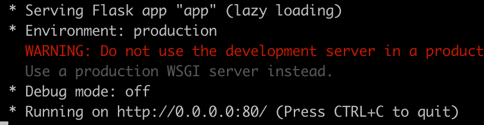

As we can see the app is running on the localhost, 0.0.0.0 and the port 80 which we configured in the last line of app.py

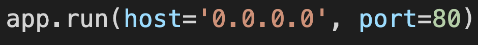

to test it out, we can open localhost:80 in our browser to get the response

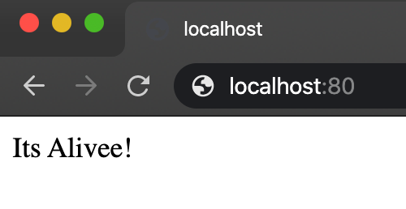

Now to test out the inference API, we are going to use postman with the below configuration

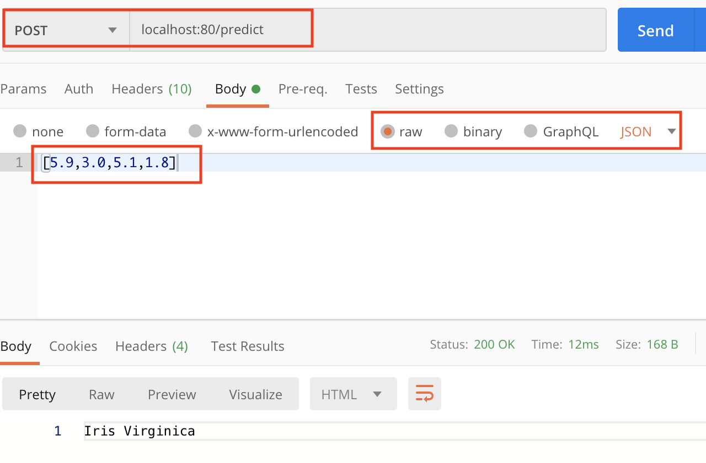

Method: POST <br/>
url: localost:80/predict <br/>
Body: (raw-->JSON) [5.9,3.0,5.1,1.8]


Now that our app is working fine on local, we can go ahead with the next steps.

Just to make it a bit closer to production, I'm going to upload the model file to object storage and try accessing it from there but you can skip this part and directly to the docker build

# IBM COS
We are going to upload the model in IBM Cloud Object Storage and use boto3 to retrieve it whenever required

* you'd need an [IBM Cloud](cloud.ibm.com) lite Account
* From catalogue create an object storage service

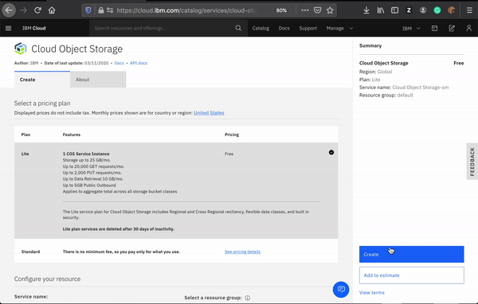


If you come across an error like this


that is because you already have an instance of COS created which you can find under resource list --> Storage


Once you are in your Cloud Object Storage you can create a new set of Service credentials from the side tab

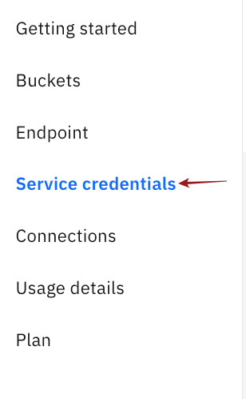

Click on New credentials and check the box to 'Include HMAC Credentials'

HMAC authentication is an s3 compatible method which works on an Access Key and its Secret

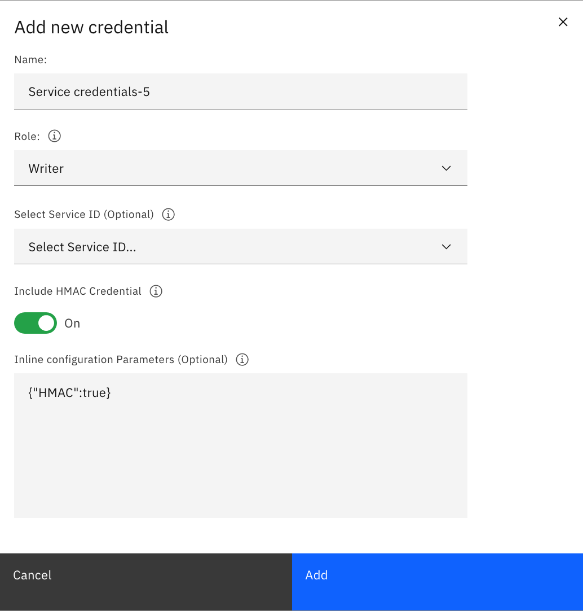

from the generated credentials you will be needing the 'access_key_id' and 'secret_access_key'

Now let's create a new bucket,
* click on create on top and then choose a custom bucket.
* Give a unique name to the bucket, usually adding a couple of integers, in the end, makes it unique then go with the following options

 Resiliency: Regional <br/>
 Location: us-east <br/>
 Storage class: Standard

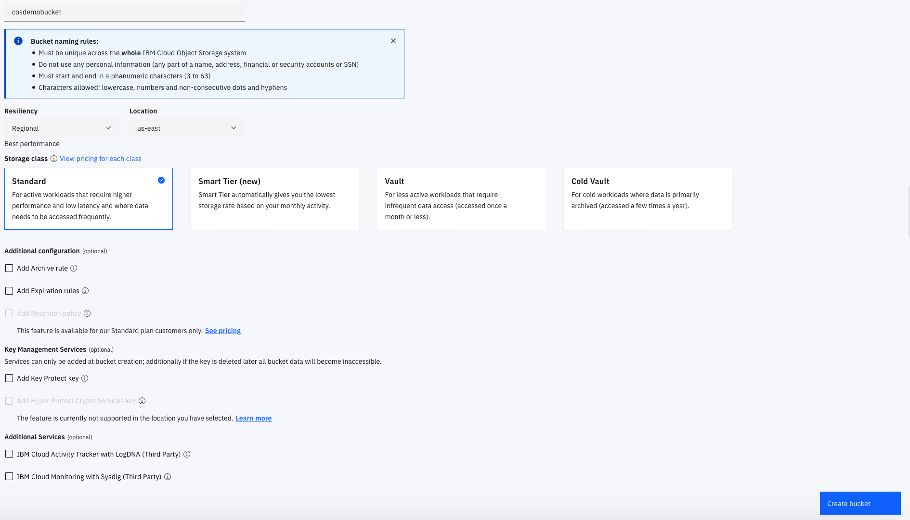

Once the bucket is created you can upload the model file using the upload option on top or drag and drop it

Now we are all set for the next part

# Model download helper

Update your credentials in the config.json file and remember to replace the region that you used in the endpoint URL as well

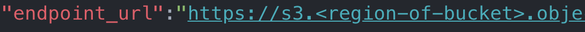

the get_model.py file uses this config file to establish a connection and download the .pkl file from the specified bucket into models/ folder when required

# Dockerizing the entire Build

We are going to use the python:3.6-slim image as our base image and then create a /deploy folder to put our code <br/>

you can see that during the build, we are running the get_model.py to download model files and put them in the models repo then removing the config.json file 


Which is not a suggested way of doing it, but for now to make it a bit easier we are going ahead with this way.

And the config.json is no longer part of the image so the credentials are safe as long the build is being done on a trusted pc. But this defeats the purpose of having the model files in a COS.why download from COS if you can simply copy the model files?

In an actual production scenario, we will be using secrets to send in our HMAC credentials then create a separate persistent volume on one of the master nodes that sends the models to the required nodes post-deployment

Apart from that side note,everything else is a standard docker way of doing things

Additionally, you can choose to remove the --quiet flag sent to pip install in line 6 to see the progress

# Building the Docker Image
We are going to use docker to build the image and push it to a public container registry. <br/>
In production, we use private container registries

To build the docker image, first, ensure docker is running on your machine and then run the following command

```
docker build -t iriscos . 
```
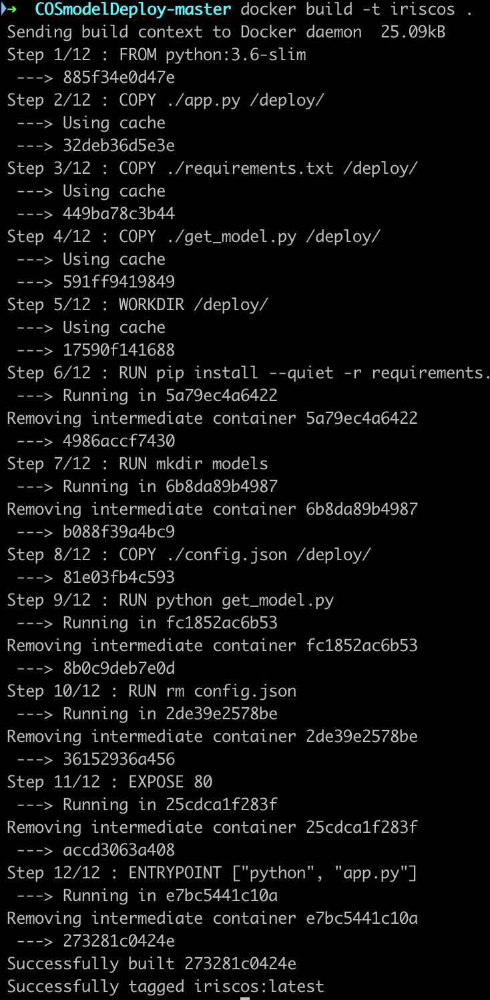

You can check to see if the image is built correctly by running it

```
docker container run --rm -p 80:80 iriscos
```

That runs the image as a container, and the '--rm' tells docker to remove the container upon exit and '-p' maps the port(80) of local host to that of the docker container(80).

We will see similar output given during the flask app run

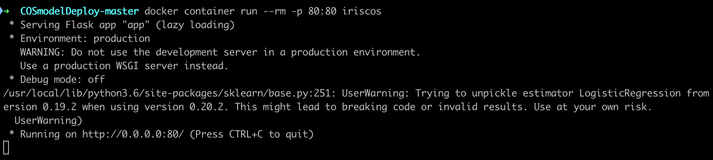

to test it out you can point the browser to 'localhost:80' and also send a POST request using postman like we did before

We need to publish the image to a container registry for the Kubernetes to pick it up and start creating deployments. we are going to use docker hub for it.<br/>
* Create an account at hub.docker.com
* From terminal login to your account
```
docker login
```
You are given a unique user name while creating your docker hub account, we are going to tag the image that we built in the previous steps with that <username>/<imagename>:version

for example,<br/>
my username: krishnac7 <br/>
imagename: iriscos <br/>
version : v1

```
docker tag iriscos krishnac7/iriscos:v1
```

The version tag is docker's way of maintaining multiple versions of the image. the most recent version of the image is accessible by using the ':latest' tag or by the specific version

Once we've tagged the image, you can start pushing it to the hub
```
docker push krishnac7/iriscos:v1
```
the default container registry used is the docker hub

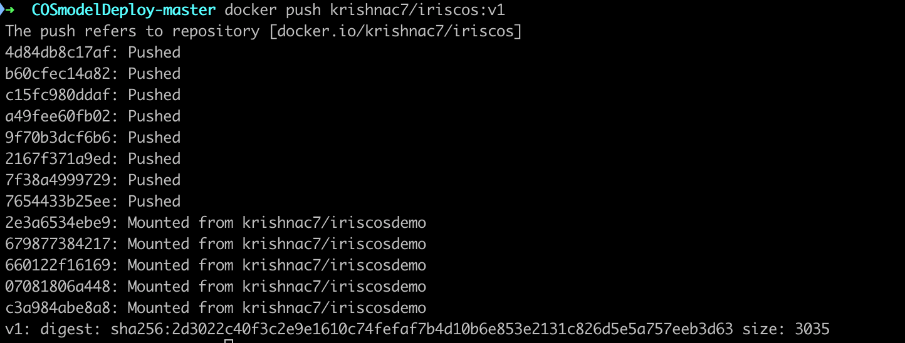

the way container registries work is a magic in itself. You won't have to upload every layer, each layer comes with a GUID(Globally Unique ID) and when docker sees any layer with the same GUID in the registry, it just mounts it. This is only possible because of the way union file system looks at each modification as a diff on the original 'read-only' layer

Once you are done, you can head to hub.docker.com and you will be able to see a new image appear there

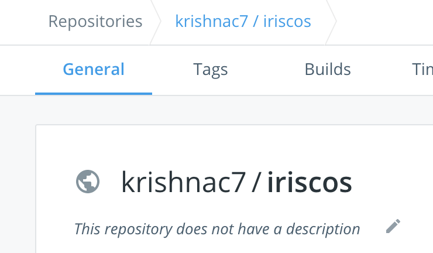

# Setting up kubectl

you will need the following tools installed on your system:
* IBM Cloud CLI
* Kubectl

Once you have the requirements, in terminal login to your IBM Cloud account

```
ibmcloud login
```
or 
```
ibmcloud login --sso
```
if you are using a federated id

Post login you need to install the container service plugin
```
ibmcloud plugin install container-service -r Bluemix
```

Once your cluster creation is done, you can see the status of your cluster from CLI as well

```
ibmcloud cs clusters
```
that will list the available clusters for us

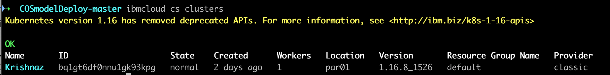

as you can see the name of my cluster is 'Krishnaz'

To configure kubectl to work with the cluster created on IBM cloud rather than the local variant, we have to enter the following command in the terminal

```
ibmcloud cs cluster-config --cluster Krishnaz
```

Where Krishnaz is the name of my cluster and yours can be different

Now when we check for the existing pods or deployments, you will notice that there are none
```
kubectl get pods
kubectl get deploments
```
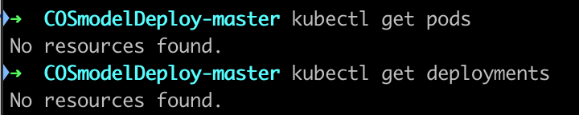

# Interpreting the deployment YAML

We've created a single deployment YAML file. Usually, for bigger deployments, we have separate YAML for each service and each deployment

When you look into the YAML you will see a place where we have to configure our image details

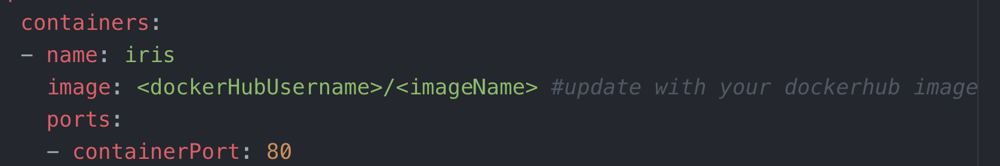

it also takes the images from dockerhub by default

# Deploy the application on Kubernetes 
Thanks to the declarative operation style of Kubernetes, all we have to do is simply send the YAML file and instruct the Kubernetes engine to build the app accordingly

```
kubectl apply -f kubernetes-deployment.yaml
```
As it understands the context that you are asking these changes to be made on the Kubernetes cluster sitting on IBM cloud, it sends the file to the orchestrator and asks it to make the necessary changes.

On the side, you can also watch the pods being created in real-time. In a separate terminal window, type

```
kubectl get -w pods
```
that invokes the built-in watch feature of kubectl which shows you updates whenever there is a state change

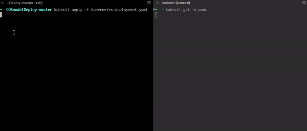

We've successfully created 3 replicas of our app and also, we have created a NodePort service

```
kubectl get services
```
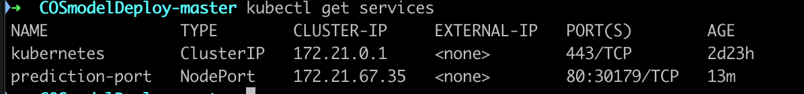

We use NodePort when we want a particular port to be exposed to the external world and the ClusterIp type of service is used for internal communication in the cluster

Note the port address that was exposed out, in this case, 30179

Now we have to get the public IP of our cluster to start communicating with or app. you can get that by listing the worker nodes of the cluster
```
ibmcloud cs workers --cluster Krishnaz
```

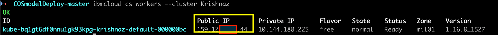

now point your browser to < public-ip >:30179

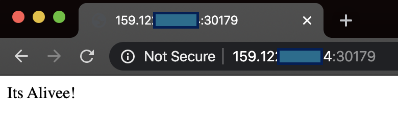

Now That is something we are familiar with! <br/>
Let's fire up postman and hit the /predict

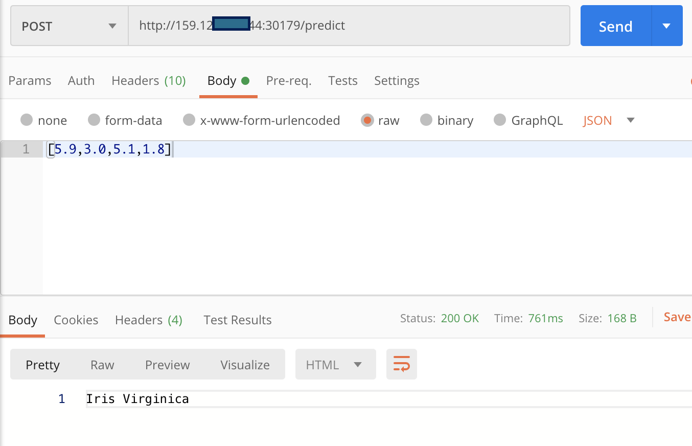

Method: POST <br/>
URL: <your-public-ip>:30179/predict<br/>
Body: (raw-->JSON) [5.9,3.0,5.1,1.8]


And finally, we have our machine learning inference app deployed on Kubernetes

# Suggested resources:
[Kubernetes Learning Path](https://developer.ibm.com/technologies/containers/series/kubernetes-learning-path/)
